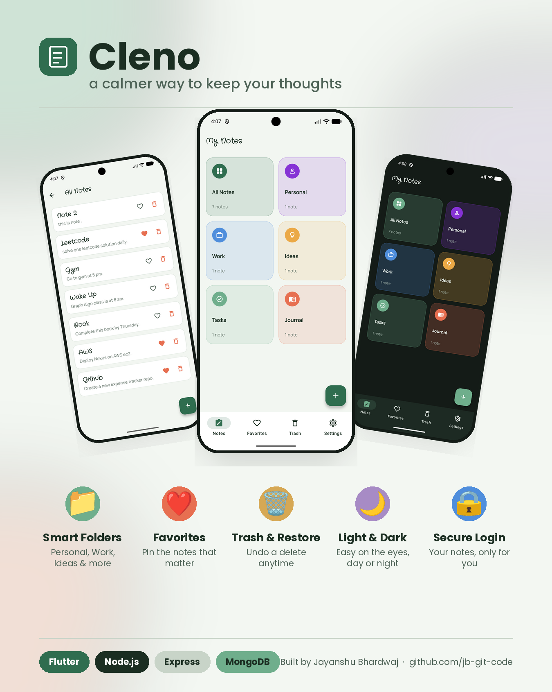

<div align="center">



</div>

# Cleno

**A calmer way to keep your thoughts.**

Cleno is a cross-platform notes app built with Flutter. It goes beyond a plain note list — notes are organized into color-coded categories, can be pinned as favorites, softly deleted into a recoverable Trash, and the whole app adapts to a light or dark theme. Every account is protected behind secure, token-based authentication.

---

## ✨ Features

| | |
|---|---|
| 📁 **Smart Folders** | Organize notes into categories — Personal, Work, Ideas, Tasks, Journal, or view everything under All Notes |
| ❤️ **Favorites** | Pin the notes that matter most for quick access from a dedicated tab |
| 🗑️ **Trash & Restore** | Deleted notes move to Trash first — restore them anytime, or delete permanently when you're sure |
| 🌗 **Light & Dark Mode** | A theme toggle that's easy on the eyes, day or night |
| 🔒 **Secure Login** | Token-based authentication keeps every account's notes private |
| ⚡ **Quick Capture** | A floating action button and clean editor make jotting down a note fast |
| 🔄 **Pull to Refresh** | Sync your latest notes with a simple pull-down gesture |

---

## 📱 How to Use

1. **Create an account** — Register with your name, email, and password.
2. **Log in** — Sign in to land on your Notes home screen.
3. **Browse by category** — Tap **All Notes** to see everything, or tap a category tile (Personal, Work, Ideas, Tasks, Journal) to see just those notes.
4. **Add a note** — Tap the **+** button from any screen. Give it a title, write your content, and pick a category chip before saving.
5. **Edit a note** — Tap any note card to open it, make changes, switch its category, or mark it as a favorite with the heart icon.
6. **Favorite a note** — Tap the heart icon on a note card, or from inside the note editor, to pin it to the **Favorites** tab.
7. **Delete a note** — Tap the trash icon on a note card to move it to **Trash**. Nothing is deleted permanently at this point.
8. **Restore or permanently delete** — Open the **Trash** tab to restore a note back to its category, or delete it forever.
9. **Switch themes** — Head to **Settings** and toggle **Dark Mode** on or off.
10. **Log out** — Also from **Settings**, when you're ready to sign out.

---

## 🛠️ Tech Stack

**Frontend**
- [Flutter](https://flutter.dev/) — cross-platform UI toolkit
- [Riverpod](https://riverpod.dev/) — state management
- [go_router](https://pub.dev/packages/go_router) — declarative routing
- [Hive](https://pub.dev/packages/hive) — local on-device storage (categories, favorites, trash, theme preference)
- [flutter_secure_storage](https://pub.dev/packages/flutter_secure_storage) — encrypted auth token storage
- [Google Fonts](https://pub.dev/packages/google_fonts) — typography
- [Freezed](https://pub.dev/packages/freezed) — immutable models and state classes
- [Dio](https://pub.dev/packages/dio) — HTTP client

**Backend**
- [Node.js](https://nodejs.org/) + [Express](https://expressjs.com/) — REST API
- [MongoDB](https://www.mongodb.com/) — database

**Infrastructure**
- Deployed on [Render](https://render.com/)
- Kept awake with [UptimeRobot](https://uptimerobot.com/), pinging the server periodically to avoid cold starts on Render's free tier

---

## 🚀 Getting Started

```bash
# Clone the repository
git clone https://github.com/jb-git-code/<notes>.git
cd <notes>

# Install dependencies
flutter pub get

# Run the app
flutter run
```

Make sure your backend API URL is configured (e.g. in `lib/features/constants/apiConstants.dart`) to point at your running backend instance.

---

## 👤 Author

**Jayanshu Bhardwaj**
GitHub: [github.com/jb-git-code](https://github.com/jb-git-code)

---

<div align="center">
Made with 🌿 and Flutter
</div>
